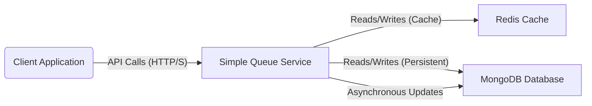

# High-Level Design (HLD) Document

## 1. Introduction

This High-Level Design (HLD) document provides an architectural overview of the Simple Queue Service (SQS). It outlines the primary components, their interactions, and the overall structure of the system without delving into implementation specifics. The SQS aims to provide a lightweight, multi-tenant message queuing solution leveraging Spring Boot, Redis for caching, and MongoDB for persistent storage.

## 2. Goals

*   Provide a simple RESTful API for message queuing operations (push, pop, view).
*   Support multiple independent consumer groups.
*   Ensure message persistence and at-least-once delivery semantics.
*   Optimize performance using an in-memory cache (Redis).
*   Enable configurable message retention.
*   Incorporate basic security for API access.

## 3. Scope

The SQS will handle the following core functionalities:

*   **Message Ingestion (Push):** Clients can push messages to a specified consumer group.
*   **Message Consumption (Pop):** Clients can retrieve and mark as consumed the oldest available message from a specified consumer group.
*   **Message Inspection (View):** Authorized clients can view messages within a consumer group, with optional filtering.
*   **Message Persistence:** Messages will be stored durably in a database.
*   **Message Caching:** Recently pushed and unconsumed messages will be cached for faster access.
*   **Message Lifecycle Management:** Automatic deletion of old messages via a configurable retention policy.
*   **Authentication and Authorization:** Secure access to API endpoints.

Out of scope:

*   Advanced message queue features like dead-letter queues, message prioritization, or complex routing.
*   Complex distributed transaction management beyond at-least-once delivery.
*   Real-time streaming capabilities.

## 4. System Context

The Simple Queue Service acts as a backend service. It receives requests from various clients (e.g., other microservices, web applications, mobile apps) and interacts with a Redis cache and a MongoDB database to fulfill those requests.



## 5. Architectural Overview

The SQS is a microservice built on Spring Boot. It follows a layered architectural style to separate concerns and improve maintainability. The primary components are the API layer, business logic layer, and data access layer, interacting with external Redis and MongoDB services.

### 5.1 Main Components

*   **API Gateway (Implicit / External Load Balancer):** Clients typically interact through an API Gateway or Load Balancer, which routes requests to one of the SQS instances. (Not part of this service's implementation, but implied in deployment).
*   **Simple Queue Service Application (Spring Boot):**
    *   **REST Controllers:** Expose the public API endpoints (`/queue/push`, `/queue/pop`, `/queue/view`). Handle HTTP request parsing and response formatting.
    *   **Service Layer:** Implements the core business logic for message handling. This includes:
        *   `PushMessageService`: Manages adding messages to the queue (cache first, then persistent storage).
        *   `PopMessageService`: Manages retrieving and marking messages as consumed (cache first, then persistent storage).
        *   `ViewMessageService`: Manages querying messages.
        *   `CacheService`: Handles all interactions with Redis for caching.
    *   **Configuration:** Sets up Spring Boot, security, asynchronous executors, Redis, and MongoDB connections.
    *   **Models:** Data structures (`Message`, `MessageResponse`) used for internal representation and API contracts.
    *   **Asynchronous Executor:** A dedicated thread pool for non-blocking operations, primarily for writing to MongoDB from the `PushMessageService` and updating `consumed` status from `PopMessageService`.
*   **Redis Cache:** An in-memory key-value store used as a fast, temporary storage for messages. It stores messages as lists, with a configurable TTL.
*   **MongoDB Database:** A NoSQL document database used for durable message storage. Each consumer group has its own collection, and messages have a configurable TTL index for automatic cleanup.

### 5.2 Component Interactions

1.  **Push Message:**
    *   Client sends `POST /queue/push` to SQS.
    *   SQS `MessageController` validates input and delegates to `PushMessageService`.
    *   `PushMessageService` adds the message to Redis via `CacheService`.
    *   `PushMessageService` then dispatches an asynchronous task to persist the message to MongoDB and ensure a TTL index.
    *   SQS returns a `200 OK` response to the client.

2.  **Pop Message:**
    *   Client sends `GET /queue/pop` to SQS.
    *   SQS `MessageController` validates input and delegates to `PopMessageService`.
    *   `PopMessageService` attempts to retrieve the oldest message from Redis via `CacheService`.
        *   If found in Redis, the message is returned to the client, and an asynchronous task is initiated to mark the message as `consumed=true` in MongoDB.
        *   If not found in Redis, `PopMessageService` queries MongoDB to atomically find and modify the oldest unconsumed message (`consumed=false`) to `consumed=true`. If successful, the message is returned; otherwise, a `404 Not Found` is returned.
    *   SQS returns `200 OK` or `404 Not Found`.

3.  **View Message:**
    *   Client sends `GET /queue/view` to SQS.
    *   SQS `MessageController` validates input and delegates to `ViewMessageService`.
    *   `ViewMessageService` queries both Redis (for unconsumed messages) and MongoDB (for all or filtered messages), combines the unique results, sorts them, and returns a limited list to the client.
    *   SQS returns `200 OK` with a list of messages.

## 6. Data Flow

```mermaid
graph TD
    A[Client] -->|1. POST /queue/push| B(MessageController)
    B -->|2. push(message)| C(PushMessageService)
    C -->|3. addMessage(message)| D[CacheService (Redis)]
    D -- Message added --> C
    C -->|4. Async Task: save to MongoDB| E(TaskExecutor)
    E -->|5. save(message)| F[MongoTemplate]
    F -->|6. insert document| G[MongoDB (Collection: consumerGroup)]

    A -->|7. GET /queue/pop| B
    B -->|8. pop(consumerGroup)| H(PopMessageService)
    H -->|9. popMessage(consumerGroup)| D
    D -- Message from cache (or null) --> H
    alt Message Found in Cache
        H -->|10. Async Task: update MongoDB| E
        E -->|11. findAndModify(queryById, updateConsumed)| F
        F -->|12. update document| G
    else Message Not Found in Cache
        H -->|13. findAndModify(queryOldestUnconsumed, updateConsumed)| F
        F -->|14. update document & return| G
    end
    G -- Modified message (or null) --> F
    F -- Modified message (or null) --> H
    H -- Message (or empty) --> B

    A -->|15. GET /queue/view| B
    B -->|16. view(consumerGroup, count, consumed)| I(ViewMessageService)
    I -->|17. viewMessages(consumerGroup)| D
    D -- Cached messages --> I
    I -->|18. find(query)| F
    F -->|19. retrieve documents| G
    G -- Messages --> F
    F -- Messages --> I
    I -- Combined & sorted messages --> B
    B -- Response --> A
```

## 7. Non-Functional Requirements

*   **Performance:** Expected low-latency for push/pop operations due to Redis caching. Asynchronous MongoDB writes prevent blocking.
*   **Scalability:** Horizontal scalability for the Spring Boot application, Redis (e.g., Redis Cluster/Sentinel), and MongoDB (e.g., Replica Sets/Sharding).
*   **Reliability:** At-least-once message delivery. MongoDB ensures data durability. Asynchronous updates mitigate impact of transient database issues.
*   **Security:** HTTP Basic Authentication for API access with role-based authorization.
*   **Maintainability:** Modular design, clear separation of concerns, and adherence to Spring Boot best practices.
*   **Availability:** High availability can be achieved by deploying multiple instances of the SQS behind a load balancer, and using highly available configurations for Redis and MongoDB.

## 8. Deployment Considerations

*   **Containerization:** The application is packaged in a Docker image for consistent deployment.
*   **Orchestration:** Deployable on container orchestration platforms like Kubernetes for managing multiple instances, load balancing, and scaling.
*   **External Dependencies:** Requires external Redis and MongoDB instances to be accessible.
*   **Configuration:** Externalized via `application.properties` and environment variables to support different environments.

## 9. Future Enhancements

*   Integration with a proper message broker for advanced queuing features.
*   Implementation of a Dead Letter Queue (DLQ).
*   Enhanced monitoring and alerting capabilities.
*   Support for different authentication mechanisms (e.g., OAuth2, JWT).
