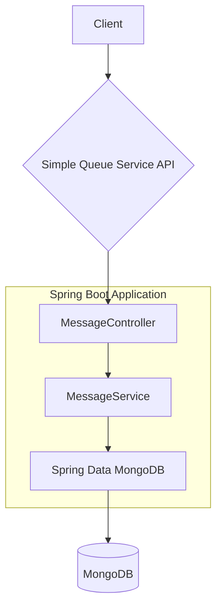
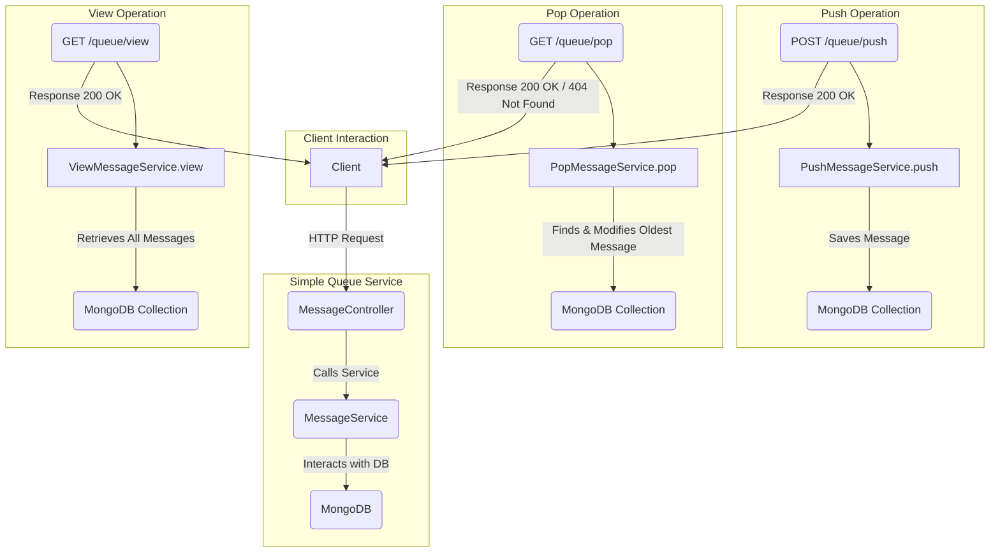
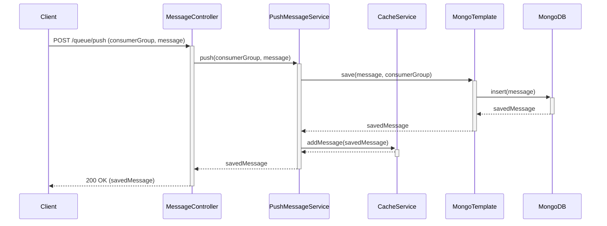

# Simple Queue Service

## Project Overview

This project is a simple, lightweight message queue service built with Spring Boot. It provides a RESTful API for pushing, popping, and viewing messages in different consumer groups. The service is designed to be easy to use and deploy, making it ideal for scenarios where a simple, multi-tenant queue is needed without the overhead of a full-fledged message broker.

## High-Level Design

### Architecture Diagram

The following diagram illustrates the high-level architecture of the Simple Queue Service:



### Workflow Flowchart

The following flowchart details the overall operational flow of the Simple Queue Service, from client interaction to data persistence, highlighting the three main operations: push, pop, and view.



## Features

*   **Multi-tenancy:** Supports multiple consumer groups, with each group having its own dedicated queue (MongoDB collection).
*   **RESTful API:** Provides a simple and intuitive API for interacting with the queue.
*   **Message Persistence:** Uses MongoDB to store messages, ensuring data durability.
*   **At-Least-Once Delivery:** The `pop` operation marks messages as processed, which is a step towards ensuring at-least-once delivery.
*   **Caching:** Leverages Redis to cache messages for faster retrieval, reducing the load on the primary database.
*   **API Documentation:** Integrated with SpringDoc to provide OpenAPI documentation.

## Message Retention

This service implements a Time-To-Live (TTL) policy for messages in MongoDB to prevent the database from growing indefinitely. Messages are automatically deleted from the queue after a configurable period.

-   **Default Retention Period:** By default, messages are retained for **30 minutes**.
-   **Configuration:** This duration can be configured in the `application.properties` file by setting the `persistence.duration.minutes` property.

## Caching (Redis)

The service utilizes Redis as a cache to improve performance for message operations. Messages are cached for a specified duration, reducing the need to frequently access MongoDB.

-   **Default Cache TTL:** Messages are cached for **5 minutes**.
-   **Configuration:** This duration can be configured in the `application.properties` file by setting the `cache.ttl.minutes` property.

## Technologies Used

*   **Java 21**
*   **Spring Boot 3.2.5**
*   **Spring Data MongoDB:** For database interaction.
*   **Spring Data Redis:** For caching messages.
*   **Spring Web:** For creating the RESTful API.
*   **Spring Security:** For securing the application, with role-based access control.
*   **Lombok:** To reduce boilerplate code.
*   **Maven:** For project build and dependency management.
*   **SpringDoc (OpenAPI 3):** For API documentation.

## API Endpoints

All endpoints are relative to the base path `/queue`.

### Authentication

The application uses HTTP Basic Authentication. Usernames and passwords are configurable via `application.properties` or environment variables.

-   **User:** Configurable with `security.user.username` (default: `user`) and `security.user.password` (default: `password`). Roles: `USER`
-   **Admin:** Configurable with `security.admin.username` (default: `admin`) and `security.admin.password` (default: `adminpassword`). Roles: `ADMIN`, `USER`

### Push a Message

*   **Method:** `POST`
*   **URL:** `/queue/push`
*   **Headers:**
    *   `consumerGroup`: The name of the consumer group (e.g., `my-app-queue`).
*   **Request Body:**
    ```json
    {
        "key": "value"
    }
    ```
*   **Response:**
    *   **200 OK:**
        ```json
        {
            "id": "632c9e6a5b7d8e1e3e8e1a1a",
            "content": "{\"key\":\"value\"}",
            "createdAt": "2025-09-22T14:30:02.123Z"
        }
        ```

### Pop a Message

*   **Method:** `GET`
*   **URL:** `/queue/pop`
*   **Headers:**
    *   `consumerGroup`: The name of the consumer group.
*   **Response:**
    *   **200 OK:** Returns the oldest unprocessed message.
        ```json
        {
            "id": "632c9e6a5b7d8e1e3e8e1a1a",
            "content": "{\"key\":\"value\"}",
            "createdAt": "2025-09-22T14:30:02.123Z"
        }
        ```
    *   **404 Not Found:** If the queue is empty.

### View All Messages (Admin Only)

*   **Method:** `GET`
*   **URL:** `/queue/view`
*   **Headers:**
    *   `consumerGroup`: The name of the consumer group.
    *   `processed` (Optional): Filter messages by their processed status (`true` or `false`).
*   **Authentication:** Requires `ADMIN` role.
*   **Response:**
    *   **200 OK:** Returns a list of all messages in the queue, optionally filtered by `processed` status.
        ```json
        [
            {
                "id": "632c9e6a5b7d8e1e3e8e1a1a",
                "content": "{\"key\":\"value\"}",
                "processed": true,
                "createdAt": "2025-09-22T14:30:02.123Z"
            }
        ]
        ```
    *   **401 Unauthorized:** If no valid credentials are provided.
    *   **403 Forbidden:** If the authenticated user does not have the `ADMIN` role.

## Low-Level Design

### Class Design

*   **`Message.java`**: This is the model class representing a message in the queue.
    *   `id`: The unique identifier for the message (auto-generated by MongoDB).
    *   `consumerGroup`: The consumer group the message belongs to.
    *   `content`: The content of the message (stored as a string).
    *   `createdAt`: Timestamp when the message was created.
    *   `processed`: A boolean flag to indicate if the message has been popped from the queue.

*   **`MessageResponse.java`**: This class represents the response structure for message operations, excluding the `processed` field.
    *   `id`: The unique identifier for the message.
    *   `content`: The content of the message.
    *   `createdAt`: Timestamp when the message was created.

*   **`MessageController.java`**: This class is responsible for handling the incoming HTTP requests.
    *   `POST /queue/push`: Pushes a new message to the queue for a specific `consumerGroup`. Returns a `MessageResponse`.
    *   `GET /queue/pop`: Pops the oldest unprocessed message from the queue for a specific `consumerGroup`. Returns a `MessageResponse`.
    *   `GET /queue/view`: Views all messages (or processed/unprocessed messages) in the queue for a specific `consumerGroup`.

*   **`PushMessageService.java`**: This class contains the business logic for pushing messages. It saves a new message to the specified `consumerGroup` collection in MongoDB and also adds it to Redis cache.

*   **`PopMessageService.java`**: This class contains the business logic for popping messages. It attempts to pop a message from Redis cache first. If not found in cache, it retrieves the oldest unprocessed message from MongoDB, marks it as processed, and returns it. This is an atomic operation.

*   **`ViewMessageService.java`**: This class contains the business logic for viewing messages. It retrieves messages from the specified `consumerGroup` collection, either from Redis cache or MongoDB based on availability and configuration.

*   **`CacheService.java`**: This service interacts with Redis to perform caching operations like adding, popping, and viewing messages from the cache.

*   **`AsyncConfig.java`**: Configures an asynchronous task executor for background tasks, such as updating messages in MongoDB after they are popped from Redis.

*   **`RedisConfig.java`**: This class configures Redis connection settings and cache managers.

*   **`SecurityConfig.java`**: This class is responsible for the security configuration of the application. It defines authentication and authorization mechanisms with role-based access control.

*   **`GlobalExceptionHandler.java`**: This class handles exceptions thrown by the application and returns appropriate HTTP responses.

*   **`SQSConstants.java`**: Contains constants used throughout the application.

### Data Model

The `Message` documents are stored in MongoDB collections. The name of the collection is the same as the `consumerGroup`. Each document has the following structure:

```json
{
    "_id": "632c9e6a5b7d8e1e3e8e1a1a",
    "content": "{\"key\":\"value\"}",
    "createdAt": "2025-09-22T14:30:02.123Z",
    "processed": false,
    "_class": "model.com.al.simplequeueservice.Message"
}
```


## Sequence Diagrams

### Push Operation



### Pop Operation

```mermaid
sequenceDiagram
    participant Client
    participant MessageController
    participant PopMessageService
    participant CacheService
    participant MongoTemplate
    participant MongoDB

    Client->>MessageController: GET /queue/pop (consumerGroup)
    activate MessageController
    MessageController->>PopMessageService: pop(consumerGroup)
    activate PopMessageService
    PopMessageService->>CacheService: popMessage(consumerGroup)
    activate CacheService
    CacheService-->>PopMessageService: Optional<cachedMessage>
    deactivate CacheService

    alt Message Found in Cache
        PopMessageService->>PopMessageService: updateMessageInMongo(messageId, consumerGroup) (Async)
        PopMessageService-->>MessageController: cachedMessage
    else Message Not Found in Cache
        PopMessageService->>MongoTemplate: findAndModify(query, update, options, Message.class, consumerGroup)
        activate MongoTemplate
        MongoTemplate->>MongoDB: findAndModify(query, update)
        activate MongoDB
        MongoDB-->>MongoTemplate: modifiedMessage
        deactivate MongoDB
        MongoTemplate-->>PopMessageService: Optional<modifiedMessage>
        deactivate MongoTemplate
        alt Message Found in MongoDB
            PopMessageService-->>MessageController: modifiedMessage
        else Message Not Found
            MessageController-->>Client: 404 Not Found
            deactivate PopMessageService
            deactivate MessageController
            return
        end
    end
    PopMessageService-->>MessageController: messageResponse
    deactivate PopMessageService
    MessageController-->>Client: 200 OK (messageResponse)
    deactivate MessageController
```

### Error Handling

*   **`GlobalExceptionHandler.java`** uses `@RestControllerAdvice` to handle exceptions globally.
*   For example, it can handle `MethodArgumentNotValidException` for validation failures and return a `400 Bad Request` response with a clear error message.
*   Custom exceptions can be created and handled here to provide specific error responses for different scenarios.

### Configuration

The following properties can be configured in `application.properties` or by setting corresponding environment variables:

*   `spring.data.mongodb.uri`: The connection URI for the MongoDB instance. Can be set via `MONGO_URI` environment variable.
*   `spring.data.mongodb.database`: The database name for MongoDB. Can be set via `MONGO_DB` environment variable.
*   `persistence.duration.minutes`: The retention period for messages in MongoDB in minutes. Default is 30.
*   `cache.ttl.minutes`: The Time-To-Live for messages in Redis cache in minutes. Default is 5.
*   `server.port`: The port on which the application will run. Default is 8080.
*   `security.user.username`: Username for the 'USER' role. Can be set via `SECURITY_USER_USERNAME` environment variable.
*   `security.user.password`: Password for the 'USER' role. Can be set via `SECURITY_USER_PASSWORD` environment variable.
*   `security.admin.username`: Username for the 'ADMIN' role. Can be set via `SECURITY_ADMIN_USERNAME` environment variable.
*   `security.admin.password`: Password for the 'ADMIN' role. Can be set via `SECURITY_ADMIN_PASSWORD` environment variable.

## Getting Started

### Prerequisites

*   Java 21 or later
*   Maven 3.2+
*   MongoDB instance running
*   Redis instance running

### Configuration

1.  Clone the repository:
    ```bash
    git clone https://github.com/Alak-Das/simple-queue-service.git
    ```
2.  Navigate to the project directory:
    ```bash
    cd simple-queue-service
    ```
3.  Configure the MongoDB and Redis connections in `src/main/resources/application.properties` or using environment variables:
    ```properties
    spring.data.mongodb.uri=mongodb://localhost:27017/mydatabase
    spring.redis.host=localhost
    spring.redis.port=6379
    ```

### Build and Run

1.  Build the project using Maven:
    ```bash
    mvn clean install
    ```
2.  Run the application:
    ```bash
    java -jar target/simple-queue-service-0.0.1-SNAPSHOT.jar
    ```

The application will be available at `http://localhost:8080`.

### API Documentation

Once the application is running, the OpenAPI documentation can be accessed at:
[http://localhost:8080/swagger-ui.html](http://localhost:8080/swagger-ui.html)
