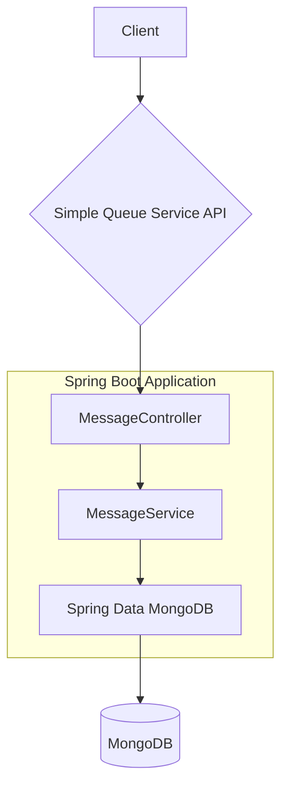

# Simple Queue Service

## Project Overview

This project is a simple, lightweight message queue service built with Spring Boot. It provides a RESTful API for pushing, popping, and viewing messages in different consumer groups. The service is designed to be easy to use and deploy, making it ideal for scenarios where a simple, multi-tenant queue is needed without the overhead of a full-fledged message broker.

## Architecture

The following diagram illustrates the high-level architecture of the Simple Queue Service:



## Features

*   **Multi-tenancy:** Supports multiple consumer groups, with each group having its own dedicated queue (MongoDB collection).
*   **RESTful API:** Provides a simple and intuitive API for interacting with the queue.
*   **Message Persistence:** Uses MongoDB to store messages, ensuring data durability.
*   **At-Least-Once Delivery:** The `pop` operation marks messages as processed, which is a step towards ensuring at-least-once delivery.
*   **API Documentation:** Integrated with SpringDoc to provide OpenAPI documentation.

## Message Retention

This service implements a Time-To-Live (TTL) policy for messages to prevent the database from growing indefinitely. Messages are automatically deleted from the queue after a configurable period.

- **Default Retention Period:** By default, messages are retained for **10 minutes**.
- **Configuration:** This duration can be configured in the `application.properties` file by setting the `message.expiry.minutes` property.

## Technologies Used

*   **Java 17**
*   **Spring Boot 3.2.5**
*   **Spring Data MongoDB:** For database interaction.
*   **Spring Web:** For creating the RESTful API.
*   **Spring Security:** For securing the application.
*   **Lombok:** To reduce boilerplate code.
*   **Maven:** For project build and dependency management.
*   **SpringDoc (OpenAPI 3):** For API documentation.

## API Endpoints

All endpoints are relative to the base path `/queue`.

### Push a Message

*   **Method:** `POST`
*   **URL:** `/queue/push`
*   **Headers:**
    *   `consumerGroup`: The name of the consumer group (e.g., `my-app-queue`).
*   **Request Body:**
    ```json
    {
        "key": "value"
    }
    ```
*   **Response:**
    *   **200 OK:**
        ```json
        {
            "id": "632c9e6a5b7d8e1e3e8e1a1a",
            "content": "{\"key\":\"value\"}",
            "processed": false,
            "createdAt": "2025-09-22T14:30:02.123Z"
        }
        ```

### Pop a Message

*   **Method:** `GET`
*   **URL:** `/queue/pop`
*   **Headers:**
    *   `consumerGroup`: The name of the consumer group.
*   **Response:**
    *   **200 OK:** Returns the oldest unprocessed message.
        ```json
        {
            "id": "632c9e6a5b7d8e1e3e8e1a1a",
            "content": "{\"key\":\"value\"}",
            "processed": true,
            "createdAt": "2025-09-22T14:30:02.123Z"
        }
        ```
    *   **404 Not Found:** If the queue is empty.

### View All Messages

*   **Method:** `GET`
*   **URL:** `/queue/view`
*   **Headers:**
    *   `consumerGroup`: The name of the consumer group.
*   **Response:**
    *   **200 OK:** Returns a list of all messages in the queue.
        ```json
        [
            {
                "id": "632c9e6a5b7d8e1e3e8e1a1a",
                "content": "{\"key\":\"value\"}",
                "processed": true,
                "createdAt": "2025-09-22T14:30:02.123Z"
            }
        ]
        ```

## Getting Started

### Prerequisites

*   Java 17 or later
*   Maven 3.2+
*   MongoDB instance running

### Configuration

1.  Clone the repository:
    ```bash
    git clone https://github.com/Alak-Das/simple-queue-service.git
    ```
2.  Navigate to the project directory:
    ```bash
    cd simple-queue-service
    ```
3.  Configure the MongoDB connection in `src/main/resources/application.properties`:
    ```properties
    spring.data.mongodb.uri=mongodb://localhost:27017/mydatabase
    ```

### Build and Run

1.  Build the project using Maven:
    ```bash
    mvn clean install
    ```
2.  Run the application:
    ```bash
    java -jar target/simple-queue-service-0.0.1-SNAPSHOT.jar
    ```

The application will be available at `http://localhost:8080`.

### API Documentation

Once the application is running, the OpenAPI documentation can be accessed at:
[http://localhost:8080/swagger-ui.html](http://localhost:8080/swagger-ui.html)
