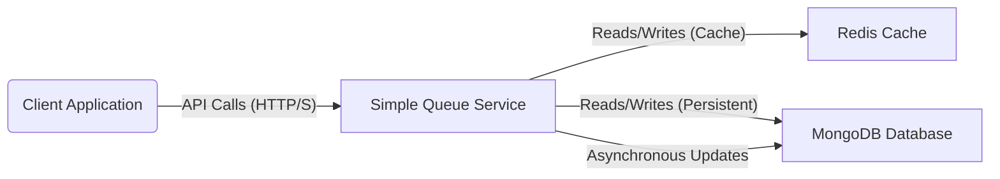

# Simple Queue Service

## Project Overview

This project implements a simple, lightweight message queue service using Spring Boot, designed to handle message pushing, popping, and viewing across different consumer groups. It leverages Redis for caching and MongoDB for persistent storage with a Time-To-Live (TTL) mechanism, ensuring efficient and scalable message management.

### Key Features:

*   **Multi-tenancy:** Supports isolated queues for different consumer groups.
*   **RESTful API:** Provides a clean and intuitive API for all queue operations.
*   **Hybrid Persistence:** Utilizes Redis for fast caching and MongoDB for durable message storage.
*   **At-Least-Once Delivery:** Messages are marked as processed to ensure reliable delivery.
*   **Configurable Message Retention:** MongoDB TTL index automatically deletes old messages.
*   **Asynchronous Operations:** Improves performance by offloading database writes to a separate thread pool.
*   **Robust Error Handling:** Global exception handling ensures graceful error responses.
*   **Security:** Role-based access control using Spring Security.
*   **API Documentation:** Integrated with SpringDoc for OpenAPI 3 documentation.

## API Design Document

### 1. Introduction

This API Design Document (ADD) specifies the RESTful API endpoints for the Simple Queue Service (SQS). It details the available operations, request/response formats, authentication requirements, and error handling for interacting with the message queue system.

### 2. Base URL

All API endpoints are prefixed with: `/queue`

### 3. Authentication

The SQS API requires HTTP Basic Authentication for all protected endpoints. User credentials (username and password) are configured in the `application.properties` file or via environment variables.

### Configured Users:

*   **USER Role:**
    *   Username: `security.user.username` (default: `user`)
    *   Password: `security.user.password` (default: `password`)
    *   Roles: `USER`
*   **ADMIN Role:**
    *   Username: `security.admin.username` (default: `admin`)
    *   Password: `security.admin.password` (default: `adminpassword`)
    *   Roles: `ADMIN`, `USER`

### 4. API Endpoints

#### 4.1 Push a Message

*   **Description:** Pushes a new message to the specified consumer group.
*   **HTTP Method:** `POST`
*   **Endpoint:** `/queue/push`
*   **Roles Required:** `USER`, `ADMIN`

*   **Request Headers:**
    *   `consumerGroup`: `String` (Required)
        *   **Description:** The unique identifier for the consumer group to which the message will be pushed.
        *   **Example:** `my-app-queue`

*   **Request Body:**
    *   **Content Type:** `application/json` or `text/plain`
    *   **Schema:** `String`
        *   **Description:** The actual content of the message. This can be any string, typically a JSON payload.
        *   **Example:**
            ```json
            {
                "orderId": "12345",
                "item": "Laptop",
                "quantity": 1
            }
            ```

*   **Success Response (200 OK):**
    *   **Content Type:** `application/json`
    *   **Schema:** `MessageResponse` object
        ```json
        {
            "id": "e4f8a9d7-b3c6-4e1d-8f2a-0b9c7d6a5e4f",
            "content": "{\"orderId\":\"12345\",\"item\":\"Laptop\",\"quantity\":1}",
            "createdAt": "2025-05-12T12:00:00.123456789"
        }
        ```
    *   **Fields:**
        *   `id`: `String` - The unique identifier assigned to the pushed message.
        *   `content`: `String` - The content of the message as it was pushed.
        *   `createdAt`: `LocalDateTime` - The timestamp when the message was created in the queue.

*   **Error Responses:**
    *   `400 Bad Request`: (e.g., Missing `consumerGroup` header, invalid request body format, or empty `content`).
        ```json
        {
            "timestamp": "2025-05-12T12:00:00.123456789",
            "status": 400,
            "error": "Bad Request",
            "message": "Message content is mandatory",
            "path": "/queue/push"
        }
        ```
    *   `401 Unauthorized`: (e.g., Missing or invalid HTTP Basic credentials).
    *   `403 Forbidden`: (e.g., Authenticated user does not have `USER` or `ADMIN` role).
    *   `500 Internal Server Error`: (e.g., An unexpected server error occurred).

#### 4.2 Pop a Message

*   **Description:** Retrieves and marks as consumed the oldest available message from the specified consumer group. The message is removed from the active queue for subsequent `pop` operations.
*   **HTTP Method:** `GET`
*   **Endpoint:** `/queue/pop`
*   **Roles Required:** `USER`, `ADMIN`

*   **Request Headers:**
    *   `consumerGroup`: `String` (Required)
        *   **Description:** The unique identifier for the consumer group from which to pop the message.
        *   **Example:** `my-app-queue`

*   **Request Body:** None

*   **Success Response (200 OK):**
    *   **Content Type:** `application/json`
    *   **Schema:** `MessageResponse` object
        ```json
        {
            "id": "e4f8a9d7-b3c6-4e1d-8f2a-0b9c7d6a5e4f",
            "content": "{\"orderId\":\"12345\",\"item\":\"Laptop\",\"quantity\":1}",
            "createdAt": "2025-05-12T11:59:00.123456789"
        }
        ```
    *   **Fields:** Same as `Push a Message` success response.

*   **Error Responses:**
    *   `404 Not Found`: (e.g., No unprocessed messages found in the specified consumer group).
        ```json
        {
            "timestamp": "2025-05-12T12:05:00.123456789",
            "status": 404,
            "error": "Not Found",
            "message": "No message found to pop for consumer group my-app-queue",
            "path": "/queue/pop"
        }
        ```
    *   `401 Unauthorized`: (e.g., Missing or invalid HTTP Basic credentials).
    *   `403 Forbidden`: (e.g., Authenticated user does not have `USER` or `ADMIN` role).
    *   `500 Internal Server Error`: (e.g., An unexpected server error occurred).

#### 4.3 View Messages

*   **Description:** Retrieves a list of messages from the specified consumer group. This operation supports filtering by message consumption status and limiting the number of results.
*   **HTTP Method:** `GET`
*   **Endpoint:** `/queue/view`
*   **Roles Required:** `ADMIN`

*   **Request Headers:**
    *   `consumerGroup`: `String` (Required)
        *   **Description:** The unique identifier for the consumer group whose messages will be viewed.
        *   **Example:** `my-app-queue`
    *   `messageCount`: `int` (Required)
        *   **Description:** The maximum number of messages to retrieve. This value is constrained by `no.of.message.allowed.to.fetch` in `application.properties` (default: 50).
        *   **Example:** `10`
    *   `consumed`: `String` (Optional)
        *   **Description:** Filters messages based on their consumption status.
        *   **Accepted Values:**
            *   `"yes"`: Returns only messages that have been consumed (processed).
            *   `"no"`: Returns only messages that have not yet been consumed (unprocessed).
        *   **Default:** If not provided, returns all messages (both consumed and unconsumed).

*   **Request Body:** None

*   **Success Response (200 OK):**
    *   **Content Type:** `application/json`
    *   **Schema:** `List<Message>` objects. Note that the full `Message` entity (including `consumed` and `consumerGroup`) is returned, unlike `MessageResponse`.
        ```json
        [
            {
                "id": "e4f8a9d7-b3c6-4e1d-8f2a-0b9c7d6a5e4f",
                "content": "{\"orderId\":\"12345\",\"item\":\"Laptop\",\"quantity\":1}",
                "consumerGroup": "my-app-queue",
                "createdAt": "2025-05-12T11:59:00.123Z",
                "consumed": true
            },
            {
                "id": "f5g9b0e8-c4d7-4f2a-9e3b-1c0d8e7b6f5a",
                "content": "{\"productId\":\"XYZ\",\"action\":\"viewed\"}",
                "consumerGroup": "my-app-queue",
                "createdAt": "2025-05-12T12:01:00.456Z",
                "consumed": false
            }
        ]
        ```
    *   **Fields:**
        *   `id`: `String` - The unique identifier of the message.
        *   `content`: `String` - The content of the message.
        *   `consumerGroup`: `String` - The consumer group the message belongs to.
        *   `createdAt`: `Date` - The timestamp when the message was created.
        *   `consumed`: `Boolean` - Indicates if the message has been processed.

*   **Error Responses:**
    *   `400 Bad Request`: (e.g., Missing `consumerGroup` or `messageCount` headers, `messageCount` out of allowed range, invalid `consumed` value).
        ```json
        {
            "timestamp": "2025-05-12T12:10:00.123456789",
            "status": 400,
            "error": "Bad Request",
            "message": "Message Count should be 1 to 50.",
            "path": "/queue/view"
        }
        ```
    *   `401 Unauthorized`: (e.g., Missing or invalid HTTP Basic credentials).
    *   `403 Forbidden`: (e.g., Authenticated user does not have `ADMIN` role).
    *   `500 Internal Server Error`: (e.g., An unexpected server error occurred).

### 5. Error Handling Standard

All error responses from the API will adhere to the `ErrorResponse` JSON structure:

```json
{
    "timestamp": "2025-05-12T12:00:00.123456789",
    "status": <HTTP Status Code>,
    "error": "<HTTP Status Reason Phrase>",
    "message": "<Detailed error message>",
    "path": "<Request URI>"
}
```

### 6. OpenAPI (Swagger) Documentation

The API is self-documented using SpringDoc OpenAPI 3. Once the application is running, the interactive API documentation can be accessed at: `http://localhost:8080/swagger-ui.html`.

## Architecture Design Document

### 1. Introduction

This Architecture Design Document (ADD) provides a comprehensive overview of the Simple Queue Service (SQS), detailing its architectural style, components, interactions, and design considerations. The SQS is a lightweight, multi-tenant message queue built with Spring Boot, Redis for caching, and MongoDB for persistent storage.

### 2. Architectural Goals and Constraints

#### 2.1 Goals

*   **Simplicity:** Easy to understand, deploy, and use.
*   **Scalability:** Ability to handle increasing message volumes and consumer groups.
*   **Reliability:** Ensures at-least-once message delivery and data durability.
*   **Performance:** Fast message processing, especially for push and pop operations, leveraging caching.
*   **Security:** Secure API access with role-based authorization.
*   **Observability:** Logging and API documentation for easier monitoring and integration.

#### 2.2 Constraints

*   **Technology Stack:** Primarily Java 21, Spring Boot, Redis, MongoDB, Maven.
*   **Deployment Environment:** Designed for containerized environments (e.g., Docker).
*   **Message Size:** Assumed to be relatively small (JSON or plain text).
*   **Transactionality:** At-least-once delivery is targeted, but full distributed ACID transactions are not a primary requirement due to the nature of a message queue.

### 3. System Overview

The Simple Queue Service operates as a standalone microservice providing RESTful endpoints for managing messages. Clients interact with the service, which then orchestrates operations between an in-memory Redis cache and a persistent MongoDB database. Asynchronous processing is used for background database updates to minimize latency for client-facing operations.

**Key Interactions:**

1.  **Client-Service:** Clients send HTTP requests (push, pop, view) to the Spring Boot application.
2.  **Service-Cache (Redis):** The service interacts with Redis for quick message access and caching.
3.  **Service-Database (MongoDB):** The service persists messages to MongoDB and retrieves them when not available in the cache.
4.  **Asynchronous Tasks:** Background tasks (e.g., marking messages as consumed in MongoDB) run asynchronously to avoid blocking the main request thread.

### 4. Logical Architecture

The system is logically structured into several layers, each with distinct responsibilities.

#### 4.1 Layers

*   **Presentation Layer (Controller):** Handles incoming HTTP requests, performs basic input validation, and delegates to the Service Layer.
    *   `MessageController`
*   **Service Layer (Business Logic):** Contains the core business logic for message queue operations. Orchestrates interactions with data access layers and cache.
    *   `PushMessageService`
    *   `PopMessageService`
    *   `ViewMessageService`
    *   `CacheService`
*   **Data Access Layer (Repository/Template):** Abstracts the details of interacting with MongoDB and Redis.
    *   `MongoTemplate` (implicitly used by services)
    *   `RedisTemplate` (used by `CacheService`)
*   **Configuration Layer:** Manages application-wide settings, security, and infrastructure beans.
    *   `AsyncConfig`
    *   `RedisConfig`
    *   `SecurityConfig`
*   **Model Layer:** Defines the data structures used throughout the application.
    *   `Message`
    *   `MessageResponse`
    *   `ErrorResponse`
*   **Utility Layer:** Provides common constants and helper functions.
    *   `SQSConstants`
*   **Exception Handling Layer:** Centralized exception handling to provide consistent error responses.
    *   `GlobalExceptionHandler`

#### 4.2 Modules and Their Responsibilities

*   **`com.al.simplequeueservice.controller`:** Defines the RESTful API endpoints and handles request/response serialization.
*   **`com.al.simplequeueservice.service`:** Implements the core message queue logic, including caching, persistence, and message lifecycle management.
*   **`com.al.simplequeueservice.model`:** Contains plain old Java objects (POJOs) representing messages and API responses.
*   **`com.al.simplequeueservice.config`:** Configures Spring Boot components, security, asynchronous tasks, and database/cache connections.
*   **`com.al.simplequeueservice.exception`:** Provides custom exception classes and a global handler for consistent error reporting.
*   **`com.al.simplequeueservice.util`:** Stores application-wide constants and utility methods.

### 5. Viewpoints

#### 5.1 Runtime View

1.  **Message Push Flow:**
    *   Client sends POST request to `/queue/push` with `consumerGroup` header and message content.
    *   `MessageController` receives the request.
    *   `PushMessageService` is invoked.
    *   `CacheService` adds the message to Redis (LPUSH) with a TTL.
    *   An asynchronous task is submitted to `taskExecutor`.
    *   The asynchronous task checks/creates a TTL index on the `consumerGroup` collection in MongoDB and then saves the message using `MongoTemplate`.
    *   `MessageController` returns `200 OK` with `MessageResponse`.

2.  **Message Pop Flow:**
    *   Client sends GET request to `/queue/pop` with `consumerGroup` header.
    *   `MessageController` receives the request.
    *   `PopMessageService` is invoked.
    *   `CacheService` attempts to pop the oldest message from Redis (RPOP).
        *   **If message found in Redis:** `PopMessageService` returns the message. An asynchronous task is submitted to `taskExecutor` to update the `consumed` status of this message in MongoDB.
        *   **If message not found in Redis:** `PopMessageService` queries MongoDB using `MongoTemplate.findAndModify` to atomically find the oldest unconsumed message, mark it as consumed, and return it. If no message is found, returns empty.
    *   `MessageController` returns `200 OK` with `MessageResponse` or `404 Not Found`.

3.  **Message View Flow:**
    *   Client sends GET request to `/queue/view` with `consumerGroup`, `messageCount`, and optional `consumed` headers.
    *   `MessageController` receives the request and performs basic validation on `messageCount`.
    *   `ViewMessageService` is invoked.
    *   **If `consumed` is "no" (unconsumed):**
        *   `CacheService.viewMessages()` retrieves messages from Redis.
        *   `MongoTemplate.find()` retrieves additional unconsumed messages from MongoDB, excluding those already found in Redis.
    *   **If `consumed` is "yes" (consumed) or not provided:**
        *   `MongoTemplate.find()` retrieves messages from MongoDB (with or without `consumed` filter).
    *   Results are combined, sorted by `createdAt`, and limited by `messageCount`.
    *   `MessageController` returns `200 OK` with a list of `Message` objects.

#### 5.2 Deployment View

The application is packaged as a JAR file and can be deployed as a standalone Spring Boot application. The `Dockerfile` indicates containerization support, making it suitable for deployment in Docker environments, Kubernetes, or other cloud platforms.

**Dependencies:**

*   **Application Instance(s):** One or more instances of `simple-queue-service.jar`.
*   **MongoDB Instance(s):** A running MongoDB server (can be a replica set for high availability).
*   **Redis Instance(s):** A running Redis server (can be a Sentinel or Cluster setup for high availability).

**Scaling:**

*   **Application:** Can be scaled horizontally by running multiple instances. Load balancing would distribute requests among them.
*   **MongoDB:** Can be scaled using replica sets (for high availability and read scaling) and sharding (for write and storage scaling).
*   **Redis:** Can be scaled using Redis Sentinel (for high availability) or Redis Cluster (for sharding and higher throughput).

#### 5.3 Security View

*   **Authentication:** HTTP Basic Authentication is used to verify the identity of clients. User credentials are configurable.
*   **Authorization:** Role-based access control (RBAC) is implemented using Spring Security. Different endpoints require specific roles (`USER` or `ADMIN`).
*   **CSRF Protection:** Disabled as it's a RESTful API primarily consumed by non-browser clients or clients handling their own CSRF tokens.
*   **Data in Transit:** Assumes TLS/SSL is handled at the infrastructure level (e.g., Load Balancer, API Gateway) if deployed in a production environment.
*   **Data at Rest:** MongoDB and Redis should be configured with appropriate security measures (e.g., authentication, encryption at rest) at the infrastructure level.

### 6. Quality Attributes

*   **Performance:** Achieved through Redis caching for frequently accessed messages and asynchronous processing for database writes.
*   **Scalability:** Designed for horizontal scaling of application instances, MongoDB, and Redis.
*   **Reliability:** At-least-once delivery guarantee for messages. Data durability provided by MongoDB. Redis provides quick recovery from failures due to its persistence options and high availability configurations.
*   **Maintainability:** Modular design, clear separation of concerns, and use of Spring Boot conventions.
*   **Security:** Implemented with Spring Security for authentication and authorization. Configurable user roles.
*   **Usability:** RESTful API with clear documentation via SpringDoc.

### 7. Future Considerations

*   **Message Ordering Guarantees:** While current implementation pops oldest message, for stricter ordering guarantees across distributed instances, a distributed lock or more advanced message broker might be needed.
*   **Dead Letter Queue (DLQ):** Implement a mechanism for messages that fail processing multiple times.
*   **Monitoring and Alerting:** Integrate with monitoring tools (e.g., Prometheus, Grafana) for deeper insights.
*   **Distributed Tracing:** Implement distributed tracing (e.g., with Zipkin/Sleuth) for better debugging in a microservices environment.
*   **Event Sourcing/CQRS:** For complex scenarios requiring event history or separate read/write models.
*   **More Robust Authentication:** Consider OAuth2/JWT for token-based authentication in more complex ecosystems.
*   **Configuration Management:** Externalize configuration further using Spring Cloud Config or similar solutions.

## Database Design Document

### 1. Introduction

This document describes the database design for the Simple Queue Service. The service primarily uses MongoDB for persistent message storage and Redis as an in-memory cache.

### 2. MongoDB Design

MongoDB is used as the primary data store for all messages. Each consumer group has its own dedicated collection in MongoDB, ensuring logical separation and multi-tenancy.

#### 2.1 Data Model: `Message`

Messages are stored as documents in MongoDB collections. The structure of a `Message` document is as follows:

*   **Collection Name:** Dynamically determined by the `consumerGroup` header (e.g., `my-app-queue`).

*   **Document Structure:**
    ```json
    {
        "_id": "<UUID string>",
        "content": "<string (JSON or plain text)>",
        "consumerGroup": "<string>",
        "createdAt": "<ISODate>",
        "consumed": <boolean>,
        "_class": "com.al.simplequeueservice.model.Message" // Spring Data MongoDB specific field
    }
    ```

*   **Field Descriptions:**
    *   `_id`: `String` - A unique identifier for the message, generated as a UUID. This is the primary key in MongoDB.
    *   `content`: `String` - The actual content of the message. This can be a JSON string, plain text, or any other serializable string.
    *   `consumerGroup`: `String` - The logical grouping to which the message belongs. This value directly maps to the MongoDB collection name where the message is stored.
    *   `createdAt`: `ISODate` - A timestamp indicating when the message was initially pushed into the queue. This field is crucial for both ordering (popping the oldest message) and for applying the TTL index.
    *   `consumed`: `Boolean` - A flag indicating whether the message has been processed.

### 2.2 MongoDB Indexes

*   **TTL Index on `createdAt`:**
    *   **Purpose:** Automatically removes messages from the database after a specified retention period.
    *   **Configuration:** Created on the `createdAt` field with `expireAfterSeconds` set based on the `persistence.duration.minutes` application property.
    *   **Per Collection:** A separate TTL index is maintained for each `consumerGroup` collection.

*   **Compound Index on `consumerGroup`, `consumed`, `createdAt`:**
    *   **Purpose:** Optimizes queries for `pop` and `view` operations, which frequently filter by `consumerGroup` and `consumed` status, and sort by `createdAt`.
    *   **Configuration:** `{ "consumerGroup": 1, "consumed": 1, "createdAt": 1 }`
    *   **Note:** While `consumerGroup` is implicitly indexed by being part of the collection name (and thus used in collection lookups), a compound index further optimizes queries within that collection.

## 3. Redis Design

Redis is utilized as an in-memory cache for fast access to recently pushed and unconsumed messages. It acts as a hot store to reduce latency for `push` and `pop` operations.

### 3.1 Data Model: Message List

*   **Key Name:** `sqs:cache:<consumerGroup>` (e.g., `sqs:cache:my-app-queue`)
*   **Data Type:** Redis List (`LPUSH` for adding, `RPOP` for popping).
*   **Value:** Serialized `Message` objects (JSON format).

### 3.2 Key Expiration (TTL)

*   **Purpose:** Ensures that cached messages are automatically removed from Redis after a configurable duration, preventing stale data and managing memory usage.
*   **Configuration:** The TTL for each Redis list is set to `cache.ttl.minutes` (from `application.properties`) upon the first message being added to a new consumer group's cache.

## 4. Relationship between MongoDB and Redis

*   **Push:** Messages are first written to Redis (cache) and then asynchronously persisted to MongoDB (durable storage).
*   **Pop:** The service first attempts to pop a message from Redis. If successful, the message is returned, and an asynchronous task updates its `consumed` status in MongoDB. If not found in Redis, the service directly queries MongoDB to atomically pop and update the oldest unconsumed message.
*   **View:** Messages can be viewed from both Redis (for unconsumed, recent messages) and MongoDB (for all messages, or specific consumed/unconsumed messages), with deduplication and sorting applied before returning to the client.

This hybrid approach leverages Redis for speed and MongoDB for durability and comprehensive historical data, providing a robust and performant queueing solution.

## High-Level Design (HLD) Document

### 1. Introduction

This High-Level Design (HLD) document provides an architectural overview of the Simple Queue Service (SQS). It outlines the primary components, their interactions, and the overall structure of the system without delving into implementation specifics. The SQS aims to provide a lightweight, multi-tenant message queuing solution leveraging Spring Boot, Redis for caching, and MongoDB for persistent storage.

### 2. Goals

*   Provide a simple RESTful API for message queuing operations (push, pop, view).
*   Support multiple independent consumer groups.
*   Ensure message persistence and at-least-once delivery semantics.
*   Optimize performance using an in-memory cache (Redis).
*   Enable configurable message retention.
*   Incorporate basic security for API access.

### 3. Scope

The SQS will handle the following core functionalities:

*   **Message Ingestion (Push):** Clients can push messages to a specified consumer group.
*   **Message Consumption (Pop):** Clients can retrieve and mark as consumed the oldest available message from a specified consumer group.
*   **Message Inspection (View):** Authorized clients can view messages within a consumer group, with optional filtering.
*   **Message Persistence:** Messages will be stored durably in a database.
*   **Message Caching:** Recently pushed and unconsumed messages will be cached for faster access.
*   **Message Lifecycle Management:** Automatic deletion of old messages via a configurable retention policy.
*   **Authentication and Authorization:** Secure access to API endpoints.

Out of scope:

*   Advanced message queue features like dead-letter queues, message prioritization, or complex routing.
*   Complex distributed transaction management beyond at-least-once delivery.
*   Real-time streaming capabilities.

### 4. System Context

The Simple Queue Service acts as a backend service. It receives requests from various clients (e.g., other microservices, web applications, mobile apps) and interacts with a Redis cache and a MongoDB database to fulfill those requests.



### 5. Architectural Overview

The SQS is a microservice built on Spring Boot. It follows a layered architectural style to separate concerns and improve maintainability. The primary components are the API layer, business logic layer, and data access layer, interacting with external Redis and MongoDB services.

#### 5.1 Main Components

*   **API Gateway (Implicit / External Load Balancer):** Clients typically interact through an API Gateway or Load Balancer, which routes requests to one of the SQS instances. (Not part of this service's implementation, but implied in deployment).
*   **Simple Queue Service Application (Spring Boot):**
    *   **REST Controllers:** Expose the public API endpoints (`/queue/push`, `/queue/pop`, `/queue/view`). Handle HTTP request parsing and response formatting.
    *   **Service Layer:** Implements the core business logic for message handling. This includes:
        *   `PushMessageService`: Manages adding messages to the queue (cache first, then persistent storage).
        *   `PopMessageService`: Manages retrieving and marking messages as consumed (cache first, then persistent storage).
        *   `ViewMessageService`: Manages querying messages.
        *   `CacheService`: Handles all interactions with Redis for caching.
    *   **Configuration:** Sets up Spring Boot, security, asynchronous executors, Redis, and MongoDB connections.
    *   **Models:** Data structures (`Message`, `MessageResponse`) used for internal representation and API contracts.
    *   **Asynchronous Executor:** A dedicated thread pool for non-blocking operations, primarily for writing to MongoDB from the `PushMessageService` and updating `consumed` status from `PopMessageService`.
*   **Redis Cache:** An in-memory key-value store used as a fast, temporary storage for messages. It stores messages as lists, with a configurable TTL.
*   **MongoDB Database:** A NoSQL document database used for durable message storage. Each consumer group has its own collection, and messages have a configurable TTL index for automatic cleanup.

#### 5.2 Component Interactions

1.  **Push Message:**
    *   Client sends `POST /queue/push` to SQS.
    *   SQS `MessageController` validates input and delegates to `PushMessageService`.
    *   `PushMessageService` adds the message to Redis via `CacheService`.
    *   `PushMessageService` then dispatches an asynchronous task to persist the message to MongoDB and ensure a TTL index.
    *   SQS returns a `200 OK` response to the client.

2.  **Pop Message:**
    *   Client sends `GET /queue/pop` to SQS.
    *   SQS `MessageController` validates input and delegates to `PopMessageService`.
    *   `PopMessageService` attempts to retrieve the oldest message from Redis via `CacheService`.
        *   If found in Redis, the message is returned to the client, and an asynchronous task is initiated to mark the message as `consumed=true` in MongoDB.
        *   If not found in Redis, `PopMessageService` queries MongoDB to atomically find and modify the oldest unconsumed message (`consumed=false`) to `consumed=true`. If successful, the message is returned; otherwise, a `404 Not Found` is returned.
    *   SQS returns `200 OK` or `404 Not Found`.

3.  **View Message:**
    *   Client sends `GET /queue/view` to SQS.
    *   SQS `MessageController` validates input and delegates to `ViewMessageService`.
    *   `ViewMessageService` queries both Redis (for unconsumed messages) and MongoDB (for all or filtered messages), combines the unique results, sorts them, and returns a limited list to the client.
    *   SQS returns `200 OK` with a list of messages.

### 6. Data Flow

```mermaid
graph TD
    A[Client] -->|1. POST /queue/push| B(MessageController)
    B -->|2. push(message)| C(PushMessageService)
    C -->|3. addMessage(message)| D[CacheService (Redis)]
    D -- Message added --> C
    C -->|4. Async Task: save to MongoDB| E(TaskExecutor)
    E -->|5. save(message)| F[MongoTemplate]
    F -->|6. insert document| G[MongoDB (Collection: consumerGroup)]

    A -->|7. GET /queue/pop| B
    B -->|8. pop(consumerGroup)| H(PopMessageService)
    H -->|9. popMessage(consumerGroup)| D
    D -- Message from cache (or null) --> H
    alt Message Found in Cache
        H -->|10. Async Task: update MongoDB| E
        E -->|11. findAndModify(queryById, updateConsumed)| F
        F -->|12. update document| G
    else Message Not Found in Cache
        H -->|13. findAndModify(queryOldestUnconsumed, updateConsumed)| F
        F -->|14. update document & return| G
    end
    G -- Modified message (or null) --> F
    F -- Modified message (or null) --> H
    H -- Message (or empty) --> B

    A -->|15. GET /queue/view| B
    B -->|16. view(consumerGroup, count, consumed)| I(ViewMessageService)
    I -->|17. viewMessages(consumerGroup)| D
    D -- Cached messages --> I
    I -->|18. find(query)| F
    F -->|19. retrieve documents| G
    G -- Messages --> F
    F -- Messages --> I
    I -- Combined & sorted messages --> B
    B -- Response --> A
```

### 7. Non-Functional Requirements

*   **Performance:** Expected low-latency for push/pop operations due to Redis caching. Asynchronous MongoDB writes prevent blocking.
*   **Scalability:** Horizontal scalability for the Spring Boot application, Redis (e.g., Redis Cluster/Sentinel), and MongoDB (e.g., Replica Sets/Sharding).
*   **Reliability:** At-least-once message delivery. MongoDB ensures data durability. Asynchronous updates mitigate impact of transient database issues.
*   **Security:** HTTP Basic Authentication for API access with role-based authorization.
*   **Maintainability:** Modular design, clear separation of concerns, and adherence to Spring Boot best practices.
*   **Availability:** High availability can be achieved by deploying multiple instances of the SQS behind a load balancer, and using highly available configurations for Redis and MongoDB.

### 8. Deployment Considerations

*   **Containerization:** The application is packaged in a Docker image for consistent deployment.
*   **Orchestration:** Deployable on container orchestration platforms like Kubernetes for managing multiple instances, load balancing, and scaling.
*   **External Dependencies:** Requires external Redis and MongoDB instances to be accessible.
*   **Configuration:** Externalized via `application.properties` and environment variables to support different environments.

### 9. Future Enhancements

*   Integration with a proper message broker for advanced queuing features.
*   Implementation of a Dead Letter Queue (DLQ).
*   Enhanced monitoring and alerting capabilities.
*   Support for different authentication mechanisms (e.g., OAuth2, JWT).

## Low-Level Design (LLD) Document

### 1. Introduction

This Low-Level Design (LLD) document provides detailed insights into the internal workings, class structures, and algorithmic logic of the Simple Queue Service (SQS). It complements the High-Level Design (HLD) and Architecture Design Document (ADD) by elaborating on the implementation specifics of individual components and modules.

### 2. Core Components and Class Design

#### 2.1 Model Classes

*   **`com.al.simplequeueservice.model.Message`**
    *   **Purpose:** Represents a single message entity within the queue system. This object is persisted in MongoDB and cached in Redis.
    *   **Annotations:** `@Getter`, `@NoArgsConstructor`, `@AllArgsConstructor`, `@Document(collection = "messages-queue")`.
    *   **Fields:**
        *   `@Id private String id;`: Unique identifier for the message, typically a UUID, auto-generated at the time of pushing.
        *   `@NotBlank(message = "Message Content is mandatory") private String content;`: The actual payload of the message, stored as a String (can be JSON, plain text, etc.). Validation ensures it's not blank.
        *   `@NotBlank(message = "Message consumerGroup is mandatory") private String consumerGroup;`: The identifier for the queue/consumer group this message belongs to. This maps directly to a MongoDB collection name. Validation ensures it's not blank.
        *   `private Date createdAt;`: Timestamp marking when the message was created and pushed into the system. Used for ordering and TTL indexing.
        *   `private boolean consumed;`: A flag indicating if the message has been popped from the queue. `false` by default, set to `true` upon successful `pop` operation.
    *   **Constructors:**
        *   `public Message(String messageId, String consumerGroup, String content)`: Convenience constructor for new messages, setting `createdAt` to current date and `consumed` to `false`.
    *   **Methods:**
        *   `public Message markConsumed()`: Returns a *new* `Message` instance with the `consumed` flag set to `true`, maintaining immutability where possible while allowing status updates.
        *   `equals(Object o)` and `hashCode()`: Implemented based on `id` for proper collection behavior.

*   **`com.al.simplequeueservice.model.MessageResponse`**
    *   **Purpose:** A Data Transfer Object (DTO) used for sending message details back to the client in API responses. It excludes internal fields like `consumerGroup` and `consumed`.
    *   **Annotations:** `@Data`, `@NoArgsConstructor`.
    *   **Fields:**
        *   `private String id;`: Unique identifier of the message.
        *   `private String content;`: The payload of the message.
        *   `private LocalDateTime createdAt;`: Timestamp of message creation, converted from `Date` to `LocalDateTime` for API consistency.
    *   **Constructors:**
        *   `public MessageResponse(Message message)`: Maps a `Message` entity to a `MessageResponse` DTO.

*   **`com.al.simplequeueservice.exception.ErrorResponse`**
    *   **Purpose:** Standardized error response format for API clients.
    *   **Annotations:** `@Data`.
    *   **Fields:** `timestamp` (LocalDateTime), `status` (int HTTP status code), `error` (String HTTP status phrase), `message` (String detailed error message), `path` (String request URI).
    *   **Constructors:** `public ErrorResponse(int status, String error, String message, String path)`.

#### 2.2 Controller Class

*   **`com.al.simplequeueservice.controller.MessageController`**
    *   **Purpose:** Handles incoming REST API requests related to message queue operations.
    *   **Annotations:** `@RestController`, `@RequestMapping("/queue")`.
    *   **Dependencies:** `@Autowired PushMessageService`, `@Autowired PopMessageService`, `@Autowired ViewMessageService`.
    *   **Endpoints:**
        *   **`POST /queue/push`:**
            *   **Input:** `@RequestHeader(SQSConstants.CONSUMER_GROUP_HEADER) String consumerGroup`, `@RequestBody String content`.
            *   **Logic:** Generates a UUID for `messageId`. Creates a `Message` object. Calls `pushMessageService.push(message)`. Returns `200 OK` with `MessageResponse`.
        *   **`GET /queue/pop`:**
            *   **Input:** `@RequestHeader(SQSConstants.CONSUMER_GROUP_HEADER) String consumerGroup`.
            *   **Logic:** Calls `popMessageService.pop(consumerGroup)`. If `Optional<Message>` is present, returns `200 OK` with `MessageResponse`. Otherwise, returns `404 Not Found`.
        *   **`GET /queue/view`:**
            *   **Input:** `@RequestHeader(SQSConstants.CONSUMER_GROUP_HEADER) String consumerGroup`, `@RequestHeader(value = SQSConstants.MESSAGE_COUNT_HEADER) int messageCount`, `@RequestHeader(value = SQSConstants.CONSUMED, required = false) String consumed`.
            *   **Logic:** Validates `messageCount` against `no.of.message.allowed.to.fetch` from properties. If invalid, returns `400 Bad Request`. Calls `viewMessageService.view(consumerGroup, messageCount, consumed)`. Returns `200 OK` with `List<Message>`.

#### 2.3 Service Classes

*   **`com.al.simplequeueservice.service.PushMessageService`**
    *   **Purpose:** Encapsulates the business logic for pushing messages.
    *   **Dependencies:** `MongoClient`, `@Value("${spring.data.mongodb.database}") String mongoDB`, `@Value("${persistence.duration.minutes}") long expireMinutes`, `MongoTemplate`, `CacheService`, `@Qualifier("taskExecutor") Executor taskExecutor`.
    *   **Method: `push(Message message)`**
        1.  Add message to Redis cache: `cacheService.addMessage(message)`.
        2.  Asynchronously save message to MongoDB:
            *   Submits a task to `taskExecutor`.
            *   Inside the async task: Calls `createTTLIndex(message)` to ensure a TTL index exists on the `createdAt` field for the `consumerGroup`'s collection.
            *   Saves the `message` to its respective `consumerGroup` collection using `mongoTemplate.save(message, message.getConsumerGroup())`.
    *   **Method: `private void createTTLIndex(Message message)`**
        1.  Retrieves the MongoDB collection for the given `consumerGroup`.
        2.  Checks if a TTL index already exists on the `createdAt` field.
        3.  If not, creates an index on `createdAt` with an `expireAfterSeconds` option derived from `expireMinutes`.

*   **`com.al.simplequeueservice.service.PopMessageService`**
    *   **Purpose:** Encapsulates the business logic for popping messages.
    *   **Dependencies:** `MongoTemplate`, `CacheService`, `@Qualifier("taskExecutor") Executor taskExecutor`.
    *   **Method: `pop(String consumerGroup)`**
        1.  **Try Cache First:** Calls `cacheService.popMessage(consumerGroup)`.
        2.  **If message found in cache:**
            *   Submits an asynchronous task to `taskExecutor` to call `updateMessageInMongo(cachedMessage.getId(), consumerGroup)`.
            *   Returns `Optional.of(cachedMessage)`.
        3.  **If message not found in cache:**
            *   Constructs a `Query` to find the oldest unconsumed message (`consumed: false`, sorted by `createdAt` ASC).
            *   Constructs an `Update` to set `consumed: true`.
            *   Uses `mongoTemplate.findAndModify(query, update, options, Message.class, consumerGroup)` to atomically retrieve and update the message.
            *   Returns `Optional.ofNullable(message)` based on the result of `findAndModify`.
    *   **Method: `private void updateMessageInMongo(String messageId, String consumerGroup)`**
        1.  Constructs a `Query` to find the message by `id`.
        2.  Constructs an `Update` to set `consumed: true`.
        3.  Uses `mongoTemplate.findAndModify()` to update the message without returning the modified document.

*   **`com.al.simplequeueservice.service.ViewMessageService`**
    *   **Purpose:** Encapsulates the business logic for viewing messages.
    *   **Dependencies:** `MongoTemplate`, `CacheService`.
    *   **Method: `view(String consumerGroup, int messageCount, String consumed)`**
        1.  Initializes an empty `List<Message> combinedMessages`.
        2.  Creates a base MongoDB `Query`.
        3.  **If `consumed` header is "no" (unconsumed messages requested):**
            *   Retrieves cached messages: `cacheService.viewMessages(consumerGroup).stream().limit(messageCount).toList()`.
            *   Adds cached messages to `combinedMessages`.
            *   Collects the `id`s of cached messages into a `Set<String> cachedMessageIds`.
            *   If `cachedMessageIds.size()` is less than `messageCount` (meaning more messages are needed):
                *   Add `Criteria.where(ID).nin(cachedMessageIds)` to the MongoDB `query` to exclude messages already found in cache.
            *   Add `Criteria.where(CONSUMED).is(false)` to the MongoDB `query`.
        4.  **If `consumed` header is "yes" (consumed messages requested):**
            *   Add `Criteria.where(CONSUMED).is(true)` to the MongoDB `query`.
        5.  **If `consumed` header is not provided (request for all messages):**
            *   No `consumed` criteria is added to the MongoDB `query`.
        6.  Sets the MongoDB `Query` limit: `query.limit(messageCount - combinedMessages.size())` (to fetch only the remaining required messages after checking cache).
        7.  Executes `mongoTemplate.find(query, Message.class, consumerGroup)` to retrieve messages from MongoDB.
        8.  Adds the retrieved MongoDB messages to `combinedMessages`.
        9.  Sorts `combinedMessages` by `createdAt` in ascending order.
        10. Returns the `combinedMessages` list to the client.

*   **`com.al.simplequeueservice.service.CacheService`**
    *   **Purpose:** Abstraction layer for Redis interactions.
    *   **Dependencies:** `RedisTemplate<String, Object>`, `@Value("${cache.ttl.minutes}") long redisCacheTtlMinutes`.
    *   **Method: `addMessage(Message message)`**
        1.  Constructs a Redis key: `SQSConstants.CACHE_PREFIX + message.getConsumerGroup()`.
        2.  `redisTemplate.opsForList().leftPush(key, message)`: Pushes the message to the head of the list.
        3.  `redisTemplate.expire(key, Duration.ofMinutes(redisCacheTtlMinutes))`: Sets a TTL for the Redis list.
    *   **Method: `popMessage(String consumerGroup)`**
        1.  Constructs the Redis key.
        2.  `redisTemplate.opsForList().rightPop(key)`: Pops and returns the message from the tail of the list (oldest).
    *   **Method: `viewMessages(String consumerGroup)`**
        1.  Constructs the Redis key.
        2.  `redisTemplate.opsForList().range(key, 0, -1)`: Retrieves all messages from the Redis list.
        3.  Filters out non-`Message` objects and casts to `Message`.

#### 2.4 Configuration Classes

*   **`com.al.simplequeueservice.config.AsyncConfig`**
    *   **Purpose:** Configures the asynchronous task executor for non-blocking operations.
    *   **Annotations:** `@Configuration`, `@EnableAsync`.
    *   **Bean: `taskExecutor()`:** Returns a `ThreadPoolTaskExecutor` with configurable `corePoolSize`, `maxPoolSize`, `queueCapacity`, and `threadNamePrefix` defined in `SQSConstants`.

*   **`com.al.simplequeueservice.config.RedisConfig`**
    *   **Purpose:** Configures Redis connection settings and cache managers.
    *   **Annotations:** `@Configuration`.
    *   **Dependencies:** `@Value("${cache.ttl.minutes}") long redisCacheTtlMinutes`.
    *   **Bean: `cacheManager(RedisConnectionFactory redisConnectionFactory)`:** Configures `RedisCacheManager` with a default `RedisCacheConfiguration` that includes a configurable `entryTtl` and `GenericJackson2JsonRedisSerializer` for value serialization.
    *   **Bean: `redisTemplate(RedisConnectionFactory connectionFactory)`:** Creates a `RedisTemplate<String, Object>` with `StringRedisSerializer` for keys and `GenericJackson2JsonRedisSerializer` for values.

*   **`com.al.simplequeueservice.config.SecurityConfig`**
    *   **Purpose:** Configures Spring Security for authentication and authorization.
    *   **Annotations:** `@Configuration`, `@EnableWebSecurity`.
    *   **Dependencies:** `@Value` for user/admin credentials from `application.properties`.
    *   **Bean: `securityFilterChain(HttpSecurity http)`:**
        *   Configures authorization rules: `/queue/push` and `/queue/pop` require `USER` or `ADMIN` roles. `/queue/view` requires `ADMIN` role. All other requests require authentication.
        *   Enables HTTP Basic Authentication (`httpBasic(withDefaults())`).
        *   Disables CSRF protection (`csrf(AbstractHttpConfigurer::disable)`) as it's a stateless REST API.
    *   **Bean: `userDetailsService(PasswordEncoder passwordEncoder)`:** Configures `InMemoryUserDetailsManager` with a `USER` and an `ADMIN` user, whose passwords are encoded using `BCryptPasswordEncoder`.
    *   **Bean: `passwordEncoder()`:** Provides a `BCryptPasswordEncoder` bean.

#### 2.5 Exception Handling

*   **`com.al.simplequeueservice.exception.GlobalExceptionHandler`**
    *   **Purpose:** Centralized exception handling across all `@Controller` classes.
    *   **Annotations:** `@ControllerAdvice`.
    *   **Methods:**
        *   `handleException(Exception ex, HttpServletRequest request)`: Catches generic `Exception` and returns `500 Internal Server Error` with an `ErrorResponse`.
        *   `handleIllegalArgumentException(IllegalArgumentException ex, HttpServletRequest request)`: Catches `IllegalArgumentException` and returns `400 Bad Request` with an `ErrorResponse`.

#### 2.6 Utility Class

*   **`com.al.simplequeueservice.util.SQSConstants`**
    *   **Purpose:** Stores static final constants used throughout the application to avoid hardcoding and improve maintainability.
    *   **Contents:** Field names (`ID`, `CONSUMED`, `CREATED_AT`), async executor parameters (`CORE_POOL_SIZE`, `MAX_POOL_SIZE`, `QUEUE_CAPACITY`, `THREAD_NAME_PREFIX`), API URLs (`QUEUE_BASE_URL`, `PUSH_URL`, `POP_URL`, `VIEW_URL`), roles (`USER_ROLE`, `ADMIN_ROLE`, `HAS_ADMIN_ROLE`), HTTP header names (`CONSUMER_GROUP_HEADER`, `MESSAGE_COUNT_HEADER`, `CONSUMED`), validation messages, and Redis cache prefix (`CACHE_PREFIX`).

### 3. Data Flow and Algorithms

Detailed data flow and sequence diagrams are provided in the [Architecture Design Document](#).

#### 3.1 Push Operation Algorithm

1.  Generate a unique `messageId` (UUID).
2.  Create a `Message` object with `messageId`, `consumerGroup`, `content`, current `createdAt` timestamp, and `consumed=false`.
3.  Call `CacheService.addMessage(message)` to add the message to Redis (LPUSH) and set its TTL.
4.  Submit an asynchronous task to `taskExecutor`:
    a.  Check for and create a MongoDB TTL index on `createdAt` for the `consumerGroup` collection if it doesn't exist, expiring after `persistence.duration.minutes`.
    b.  Save the `Message` object to the corresponding MongoDB `consumerGroup` collection using `MongoTemplate.save()`.
5.  Return the `MessageResponse` to the client.

#### 3.2 Pop Operation Algorithm

1.  Call `CacheService.popMessage(consumerGroup)` to attempt to retrieve the oldest message from Redis (RPOP).
2.  **If a message is returned from Redis:**
    a.  Submit an asynchronous task to `taskExecutor` to update the message's `consumed` status in MongoDB: `PopMessageService.updateMessageInMongo(messageId, consumerGroup)`.
    b.  Return the message to the client.
3.  **If no message is returned from Redis:**
    a.  Construct a MongoDB `Query`:
        *   `Criteria.where(CONSUMED).is(false)` to find unprocessed messages.
        *   `Sort.by(Sort.Direction.ASC, CREATED_AT)` to get the oldest message.
    b.  Construct a MongoDB `Update` to set `CONSUMED` to `true`.
    c.  Execute `mongoTemplate.findAndModify(query, update, options, Message.class, consumerGroup)` with `returnNew(true)` option.
    d.  If a message is returned by `findAndModify`, return it to the client.
    e.  If `findAndModify` returns null, return an empty `Optional` (indicating no messages to pop).

#### 3.3 View Operation Algorithm

1.  Initialize an empty list `combinedMessages`.
2.  Create a base MongoDB `Query`.
3.  **If `consumed` header is "no" (request for unconsumed messages):**
    a.  Retrieve a limited number of messages from Redis cache using `CacheService.viewMessages(consumerGroup)`.
    b.  Add these cached messages to `combinedMessages`.
    c.  Collect the `id`s of cached messages into a `Set<String> cachedMessageIds`.
    d.  If `cachedMessageIds.size()` is less than `messageCount` (meaning more messages are needed):
        *   Add `Criteria.where(ID).nin(cachedMessageIds)` to the MongoDB `Query` to exclude messages already found in cache.
    e.  Add `Criteria.where(CONSUMED).is(false)` to the MongoDB `Query`.
4.  **If `consumed` header is "yes" (request for consumed messages):**
    a.  Add `Criteria.where(CONSUMED).is(true)` to the MongoDB `Query`.
5.  **If `consumed` header is not provided (request for all messages):**
    a.  No `consumed` criteria is added to the MongoDB `Query`.
6.  Set the MongoDB `Query` limit: `query.limit(messageCount - combinedMessages.size())` (to fetch only the remaining required messages after checking cache).
7.  Executes `mongoTemplate.find(query, Message.class, consumerGroup)` to retrieve messages from MongoDB.
8.  Adds the retrieved MongoDB messages to `combinedMessages`.
9.  Sorts `combinedMessages` by `createdAt` in ascending order.
10. Returns the `combinedMessages` list to the client.

#### 4. Error Handling

The application employs a `@ControllerAdvice` (`GlobalExceptionHandler`) for centralized error handling, ensuring consistent error responses across the API. Specific exceptions like `IllegalArgumentException` are mapped to `400 Bad Request`, while other uncaught exceptions default to `500 Internal Server Error`. Error details are provided in an `ErrorResponse` DTO.

#### 5. Security Details

Spring Security is configured to enforce HTTP Basic Authentication. Users are defined in-memory with `USER` and `ADMIN` roles, whose credentials are externalized in `application.properties`. Endpoint-level authorization rules are applied:

*   `/queue/push`, `/queue/pop`: Accessible by `USER` or `ADMIN` roles.
*   `/queue/view`: Accessible only by `ADMIN` role.

CSRF protection is disabled for the RESTful API.

#### 6. Configuration Details

Key configurations are managed via `application.properties` and environment variables:

*   **MongoDB:** `spring.data.mongodb.uri`, `spring.data.mongodb.database`, `persistence.duration.minutes` (for TTL index).
*   **Redis:** `spring.redis.host`, `spring.redis.port`, `cache.ttl.minutes` (for cache entry TTL).
*   **Security:** `security.user.username`, `security.user.password`, `security.admin.username`, `security.admin.password`.
*   **Application:** `server.port`, `no.of.message.allowed.to.fetch`.

#### 7. Performance Optimizations

*   **Redis Caching:** Reduces database load and improves response times for frequently accessed messages (`push` and `pop`).
*   **Asynchronous Database Operations:** Offloads potentially blocking MongoDB write operations to a separate thread pool (`taskExecutor`), ensuring the main API thread remains responsive.
*   **MongoDB TTL Indexes:** Automates cleanup of old messages, maintaining database performance.
*   **MongoDB `findAndModify`:** Ensures atomic pop operations from the database, preventing race conditions.
*   **Indexed Queries:** MongoDB queries for `pop` and `view` operations leverage indexes on `createdAt` and `consumed` fields for efficient data retrieval.
