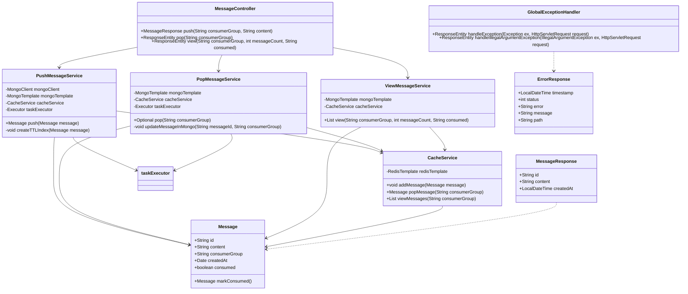

# Simple Queue Service

This project implements a simple, lightweight message queue service using Spring Boot, designed to handle message pushing, popping, and viewing operations with support for consumer groups, caching, and persistent storage.

## Table of Contents
1.  [Project Overview](#project-overview)
2.  [High-Level Design (HLD) Document](#high-level-design-hld-document)
3.  [Low-Level Design (LLD) Document](#low-level-design-lld-document)
4.  [Architecture Design Document](#architecture-design-document)
5.  [Database Design Document](#database-design-document)
6.  [API Design Document](#api-design-document)

## 1. Project Overview

The Simple Queue Service is a Spring Boot application that provides a RESTful API for managing messages in a queue-like fashion. It supports multiple consumer groups, allowing messages to be isolated and processed independently. The service leverages Redis for fast in-memory caching and MongoDB for persistent storage, ensuring both performance and data durability. Asynchronous processing is utilized for non-critical operations like database persistence to enhance responsiveness.

### Key Features:
*   **Message Pushing:** Add messages to a specific consumer group's queue.
*   **Message Popping:** Retrieve and mark messages as consumed from a consumer group's queue.
*   **Message Viewing:** Inspect messages within a consumer group, with options to filter by consumption status.
*   **Consumer Groups:** Isolate message streams for different consumers.
*   **Caching:** Uses Redis for quick access to recently pushed/unconsumed messages.
*   **Persistence:** Stores all messages in MongoDB with a Time-To-Live (TTL) mechanism for automatic data cleanup.
*   **Asynchronous Operations:** Decouples API responses from database write operations for improved performance.
*   **Security:** Basic authentication with user and admin roles to control API access.
*   **API Documentation:** Integrated Swagger UI for interactive API exploration.

## 2. High-Level Design (HLD) Document

### 2.1. System Context

The Simple Queue Service acts as a central message broker for applications requiring asynchronous communication. Producers push messages to the service, and Consumers pull messages from it. The service interacts with Redis for caching and MongoDB for long-term storage.

```mermaid
graph TD
    A[Producer Application] -->|Push Message| B(Simple Queue Service)
    B -->|Add to Cache (Redis)| C[Redis Cache]
    B -->|Persist Async (MongoDB)| D[MongoDB Database]
    E[Consumer Application] -->|Pop/View Messages| B
    B -->|Retrieve from Cache (Redis)| C
    B -->|Retrieve from DB (MongoDB)| D
    SubGraph External Systems
        A
        E
    End
```

### 2.2. High-Level Components

1.  **REST API Layer (MessageController):** Exposes endpoints for `push`, `pop`, and `view` operations.
2.  **Service Layer (PushMessageService, PopMessageService, ViewMessageService, CacheService):** Contains the core business logic for message handling, caching, and database interactions.
3.  **Caching Layer (Redis):** Provides fast in-memory storage for messages, improving read/write performance for active queues.
4.  **Persistence Layer (MongoDB):** Stores all messages for durability and supports queries for viewing messages, with a TTL mechanism.
5.  **Security Layer (SecurityConfig):** Handles authentication and authorization for API access.
6.  **Asynchronous Processing (AsyncConfig):** Manages a thread pool for offloading non-critical tasks like database writes.

### 2.3. Data Flow

*   **Push Message:**
    1.  Client sends a `POST /queue/push` request with `consumerGroup` header and message content.
    2.  `MessageController` receives the request.
    3.  `PushMessageService` adds the message to Redis cache.
    4.  `PushMessageService` asynchronously saves the message to MongoDB (creating a TTL index if necessary).
    5.  Service returns `MessageResponse`.

*   **Pop Message:**
    1.  Client sends a `GET /queue/pop` request with `consumerGroup` header.
    2.  `MessageController` receives the request.
    3.  `PopMessageService` attempts to retrieve the oldest message from Redis cache.
    4.  If found in Redis, it's returned immediately, and `PopMessageService` asynchronously marks it as consumed in MongoDB.
    5.  If not found in Redis, `PopMessageService` retrieves the oldest unconsumed message from MongoDB, marks it as consumed, and returns it.
    6.  Service returns `MessageResponse` or 404.

*   **View Messages:**
    1.  Client sends a `GET /queue/view` request with `consumerGroup` header, `messageCount`, and optional `consumed` status.
    2.  `MessageController` receives the request and validates `messageCount`.
    3.  `ViewMessageService` retrieves messages from both Redis cache (for unconsumed) and MongoDB (for all, or consumed/unconsumed).
    4.  Messages are combined, deduplicated, sorted by `createdAt`, and limited by `messageCount`.
    5.  Service returns a list of `Message` objects.

## 3. Low-Level Design (LLD) Document

### 3.1. Class Diagram (Core Components)



### 3.2. Detailed Component Descriptions

*   **`MessageController`:** Handles incoming HTTP requests, delegates to appropriate service methods, and returns `MessageResponse` or error responses. Performs basic request validation.
*   **`PushMessageService`:** Orchestrates message pushing. Adds messages to Redis (left push to list) and then asynchronously saves to MongoDB. It ensures a TTL index exists on the `createdAt` field for each `consumerGroup` collection in MongoDB.
*   **`PopMessageService`:** Manages message popping. Prioritizes fetching from Redis (right pop from list). If a message is retrieved from Redis, it's immediately returned, and an asynchronous task marks it as `consumed` in MongoDB. If Redis is empty, it queries MongoDB for the oldest `unconsumed` message, marks it `consumed` (using `findAndModify` for atomicity), and returns it.
*   **`ViewMessageService`:** Handles message viewing. Retrieves messages from both Redis (unconsumed) and MongoDB (all or filtered). It deduplicates messages and sorts them by `createdAt` before returning a limited list.
*   **`CacheService`:** An abstraction over Redis operations. Provides methods to `addMessage` (left push), `popMessage` (right pop), and `viewMessages` (range query) from Redis lists, managing the `consumerGroupMessages:{consumerGroup}` keys with a configured TTL.
*   **`Message` (Model):** Represents a message in the queue. Contains `id`, `content`, `consumerGroup`, `createdAt`, and a `consumed` flag. Implements `Serializable` for Redis caching and has an `equals`/`hashCode` based on `id`.
*   **`MessageResponse` (DTO):** A data transfer object used for API responses, containing `id`, `content`, and `createdAt` (converted to `LocalDateTime`).
*   **`ErrorResponse` (DTO):** Standardized error response structure for API clients.
*   **`GlobalExceptionHandler`:** Centralized error handling for the application, mapping exceptions to appropriate HTTP status codes and `ErrorResponse` payloads.

## 4. Architecture Design Document

### 4.1. Architectural Style

The Simple Queue Service adopts a **Monolithic Service Architecture** with clear separation of concerns into distinct layers. While monolithic, it incorporates aspects of a **Layered Architecture** and leverages external services (Redis, MongoDB) for specialized functions, moving towards a **Service-Oriented** approach for data storage and caching.

### 4.2. System Layers

1.  **Presentation/API Layer:** Handled by `MessageController`, responsible for exposing RESTful endpoints and request/response serialization/deserialization. Uses Spring Web and Swagger for documentation.
2.  **Service/Business Logic Layer:** Contains the core application logic within `PushMessageService`, `PopMessageService`, and `ViewMessageService`. This layer orchestrates interactions with the data and cache layers.
3.  **Data Access Layer (DAL):** Abstracted by Spring Data MongoDB (`MongoTemplate`) for persistent storage and `CacheService` (using `RedisTemplate`) for caching. This layer is responsible for interacting with MongoDB and Redis.
4.  **Configuration Layer:** Includes `AsyncConfig`, `RedisConfig`, and `SecurityConfig` to set up and manage infrastructure-related beans and configurations.

### 4.3. Technologies Used

*   **Core Framework:** Spring Boot (Java 21)
*   **Web:** Spring Web (RESTful API)
*   **Persistence:** Spring Data MongoDB, MongoDB
*   **Caching:** Spring Data Redis, Redis
*   **Asynchronous Processing:** Spring Async, `ThreadPoolTaskExecutor`
*   **Security:** Spring Security (HTTP Basic, In-Memory UserDetailsService)
*   **API Documentation:** Springdoc OpenAPI (Swagger UI)
*   **Utilities:** Lombok, Apache Commons Lang3

### 4.4. Deployment Strategy

The application is packaged as a Spring Boot executable JAR. It can be deployed as a standalone application. A `Dockerfile` is provided, indicating containerization using Docker for easier deployment and scalability. The service requires external Redis and MongoDB instances to be running and accessible.

## 5. Database Design Document

### 5.1. Data Stores

1.  **MongoDB (Primary Persistence):** Used for durable storage of all messages. Each consumer group has its own collection, allowing for logical separation and efficient querying within a group. Messages have a TTL index on the `createdAt` field for automatic cleanup after `persistence.duration.minutes`.
2.  **Redis (Cache):** Used as a high-speed, in-memory cache for recent and unconsumed messages. Messages for each consumer group are stored in a Redis List (`consumerGroupMessages:{consumerGroup}`), enabling fast FIFO operations (push/pop). Each Redis key (consumer group list) has a TTL of `cache.ttl.minutes`.

### 5.2. MongoDB Schema (Implicit)

Although explicit schema definitions are less common in NoSQL databases like MongoDB, the `Message` class defines the structure of documents stored in MongoDB collections. Each collection is named after a `consumerGroup`.

**Collection Name:** `{consumerGroup}` (e.g., `my-consumer-group-1`)

**Document Structure (Message):**

```json
{
  "_id": "UUID_STRING",         // Unique message identifier (String)
  "content": "Message Payload",   // Content of the message (String)
  "consumerGroup": "group-name",  // Consumer group this message belongs to (String)
  "createdAt": ISODate("..."),    // Timestamp of message creation (Date)
  "consumed": false             // Boolean flag, true if consumed (Boolean)
}
```

**Indexes:**

*   **`_id` index:** Default primary key index (unique).
*   **`createdAt` TTL index:** `{"createdAt": 1}` with `expireAfterSeconds` set based on `persistence.duration.minutes`. This index is dynamically created per consumer group collection by `PushMessageService`.
*   **`consumed` index:** A regular index on `{"consumed": 1}` to efficiently query unconsumed or consumed messages.

### 5.3. Redis Data Structure

Redis stores messages as lists, one list per consumer group.

**Key Pattern:** `consumerGroupMessages:{consumerGroup}` (e.g., `consumerGroupMessages:my-consumer-group-1`)

**Value Type:** List of `Message` objects (serialized as JSON).

**Example (Key: `consumerGroupMessages:my-group`):**

```
[ 
  { id: "msg1", content: "Hello", consumerGroup: "my-group", createdAt: "...", consumed: false },
  { id: "msg2", content: "World", consumerGroup: "my-group", createdAt: "...", consumed: false }
]
```

## 6. API Design Document

### 6.1. Base URL

`/queue`

### 6.2. Authentication

HTTP Basic Authentication is required for all endpoints. Roles are enforced as follows:

*   `USER` role: Can `push` and `pop` messages.
*   `ADMIN` role: Can `push`, `pop`, and `view` messages.

**Default Credentials (from `application.properties`):
**
*   **User:** `username: user`, `password: password`
*   **Admin:** `username: admin`, `password: adminpassword`

### 6.3. Endpoints

#### 6.3.1. Push Message

*   **Endpoint:** `POST /queue/push`
*   **Description:** Pushes a new message to the queue for a specified consumer group.
*   **Required Role:** `USER`, `ADMIN`
*   **Request Headers:**
    *   `consumerGroup`: `String` (e.g., `my-consumer-group`)
*   **Request Body:** `String` (The message content)
*   **Response:** `200 OK`
    ```json
    {
      "id": "string",
      "content": "string",
      "createdAt": "YYYY-MM-DDTHH:MM:SS"
    }
    ```
*   **Error Responses:**
    *   `400 Bad Request`: If `consumerGroup` header is missing or empty, or message content is invalid.
    *   `401 Unauthorized`: If authentication fails.
    *   `403 Forbidden`: If authenticated user does not have `USER` or `ADMIN` role.
    *   `500 Internal Server Error`: For unexpected server errors.

#### 6.3.2. Pop Message

*   **Endpoint:** `GET /queue/pop`
*   **Description:** Retrieves and marks as consumed the oldest available message from a specified consumer group.
*   **Required Role:** `USER`, `ADMIN`
*   **Request Headers:**
    *   `consumerGroup`: `String` (e.g., `my-consumer-group`)
*   **Response:** `200 OK` (if message found)
    ```json
    {
      "id": "string",
      "content": "string",
      "createdAt": "YYYY-MM-DDTHH:MM:SS"
    }
    ```
    `404 Not Found` (if no message available)
*   **Error Responses:**
    *   `400 Bad Request`: If `consumerGroup` header is missing or empty.
    *   `401 Unauthorized`: If authentication fails.
    *   `403 Forbidden`: If authenticated user does not have `USER` or `ADMIN` role.
    *   `500 Internal Server Error`: For unexpected server errors.

#### 6.3.3. View Messages

*   **Endpoint:** `GET /queue/view`
*   **Description:** Views a list of messages from a specified consumer group, with options to limit the count and filter by consumption status.
*   **Required Role:** `ADMIN`
*   **Request Headers:**
    *   `consumerGroup`: `String` (e.g., `my-consumer-group`)
    *   `messageCount`: `Integer` (Maximum number of messages to retrieve, must be between 1 and `no.of.message.allowed.to.fetch`)
    *   `consumed`: `String` (Optional.
